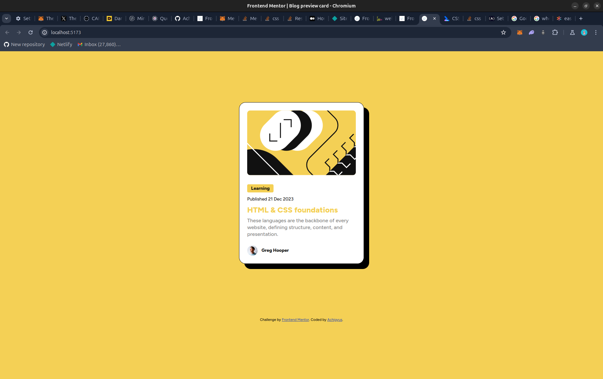

# Frontend Mentor - Blog preview card solution

This is a solution to the [Blog preview card challenge on Frontend Mentor](https://www.frontendmentor.io/challenges/blog-preview-card-ckPaj01IcS). Frontend Mentor challenges help you improve your coding skills by building realistic projects. 

## Table of contents

- [Overview](#overview)
  - [The challenge](#the-challenge)
  - [Screenshot](#screenshot)
  - [Links](#links)
- [My process](#my-process)
  - [Built with](#built-with)
  - [What I learned](#what-i-learned)
  - [Useful resources](#useful-resources)
- [Author](#author)

## Overview

### The challenge

Users should be able to:

- See hover and focus states for all interactive elements on the page

### Screenshot



### Links

- Solution URL: [Github Link](https://github.com/Achigyus/blog-preview-card)
- Live Site URL: [Live Site](https://blog-preview-achigyus.netlify.app/)

## My process

### Built with

- Semantic HTML5 markup
- CSS custom properties
- Flexbox
- Mobile-first workflow
- [React](https://reactjs.org/) - JS library

### What I learned

I learnt about using the concept of fluid typography and how it can be achieved by using units like `vw`, `vh`, `vmin`, and `vmax`. You can also achieve fluid typography by making use of CSS properties such as `min()`, `max()`, and `clamp()`

Example of the usage is below:


```css
body{
  font-size: min(3.2vw, 14px);
  line-height: 150%;
}
```

This allows the browser to pick the smaller of the two units

I also learned about when to use ease-in and ease-out for transitions. The general “rule” (in quotes) is to use them opposite of how they are named:

ease-in: when things are moving out.
ease-out: when things are moving in.

### Useful resources

- [Usage of min(), max(), and clamp()](https://web.dev/articles/min-max-clamp) - This helped me in creating fluid typography without the use of media queries
- [When to use ease-in and ease-out](https://css-tricks.com/ease-out-in-ease-in-out/) - This is an amazing article which helped me finally understand usage of ease-in and ease-out. I'd recommend it to anyone still learning this concept.

## Author

- Website - [Achigyus](https://github.com/Achigyus)
- Frontend Mentor - [@Achigyus](https://www.frontendmentor.io/profile/Achigyus)
- Twitter - [@LaAnbuUchiha](https://x.com/LaAnbuUchiha)